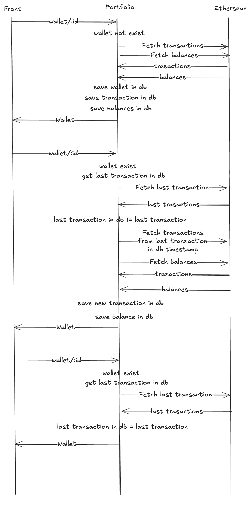

# Pre-requisites

- Node.js version: 22 or higher
- Docker installed

# Setup

In order to run this project on your machine, you'll need all three repositories cloned and running. The following steps will guide you through the process for this repository:

- Clone this repository
- Run `npm install`
- You will need to create a .env file in the root directory with the following variables:

- Example .env file for flouze_track_portfolio

```
TZ=
PORT=3333
HOST=localhost
LOG_LEVEL=info
APP_KEY=
NODE_ENV=development
DB_HOST=127.0.0.1
DB_PORT=3306
DB_USER=root
DB_PASSWORD=root
DB_DATABASE=app
LIMITER_STORE=redis
REDIS_HOST=127.0.0.1
REDIS_PORT=6379
REDIS_PASSWORD=
```

- To allow all the microservices to communicate with each other, you will need to create a network in docker. You may do so by running the following command:

```
docker network create backend
```

- Once the environment variables are set, you may run the following command in the root directory of this repository to start the docker containers:

```
docker-compose up --build
```

- The API is then available at http://localhost:5010/api/v1

# API Endpoints

- Fetch the price of the cryptocurrency of your choice for a given time period. The following endpoints are available:

  - GET prices
  - GET kpis

- Fetch the informations about a specific wallet along with its transactions. The following endpoints are available:
  - GET balances
  - GET transactions
  - GET export transactions

# Folder Structure

- This repository was built using the adonisjs framework. The folder structure is as follows:

```
app
├── Controllers
├── Services
├── Auth (Middleware for authentification)
├── Enums
├── Types
├── Models
├── Validators
├── Exceptions
├── Middleware
├── Commands
```

- This structure allows for a flexible architecture that can be easily extended and maintained.
- Inside of the controllers is a specific one meant for seeding the database. The information is cached and ready to be displayed for the user. We then fetch every day at midnight the new data (ensuring in the process that we do not have twice the same information) and update the database. This way, the user can access the information quickly and efficiently.

- The following drawing shows the architecture of the project:



# Testing

- The tests are located in the test folder. They are written using the adonisjs testing framework.
- In order to run the tests, you may use the following command:

```
npm run test
```

# Security

- The API is protected by a JWT token. The user must be authenticated in order to access the data.
- The API is also protected by a rate limiter. The user can only make a certain number of requests per minute. This is to prevent abuse of the API, especially since when the information is not cached, it can be quite costly to fetch it from the external API. The rate limiter is stored in Redis and is disabled when the tests are run.
